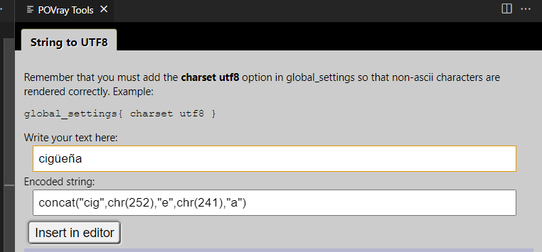

# POV-Ray Extension v2 for Visual Studio Code

(https://github.com/VirtualWhirlwind/vscode-povray2)

The [Persistence of Vision Raytracer](http://povray.org) is a high-quality, free software tool for creating three-dimensional graphics by using a Scene Description Language.

This extension allows you to use [Visual Studio Code](https://code.visualstudio.com) to edit POV-Ray Scene Description files and render them using POV-Ray in the integrated terminal.

## Getting Started

* After installing POV-Ray and this extension, open the Extension Settings and be sure to fill in:
    * Library Path
    * Pvengine Path
* Start creating .pov files and use the "P" button in the upper right to trigger rendering
* Rendering errors are not shown in VSCode yet, you need to open the pov file in the POV-Ray editor to see scene problems

## Links

[POV-Ray Official Website](http://povray.org)

[POV-Ray on GitHub](https://github.com/POV-Ray/povray)

[POV-Ray for VS Code Extension on GitHub](https://github.com/VirtualWhirlwind/vscode-povray2)

[POV-Ray for VS Code Extension in the VS Code Marketplace](https://marketplace.visualstudio.com/items?itemName=virtual-whirlwind.vscode-povray2)

[POV-Ray for VS Code Extension in the Open VSX Registry](https://open-vsx.org/extension/virtual-whirlwind/vscode-povray2)

[Lemmy.world](https://lemmy.world/c/povray)

## What's New

[View the Change Log](./CHANGELOG.md)

### Version 2.1.3

* Snippet improvements
* Development package updates

### Version 2.1.2

* Additional QOL improvements
    * Removed INI syntax highlighting

### Version 2.1.1

* Miscellaneous QOL improvements

### Version 2.1.0

* Added code completion (similar to IntelliSense) for several default library files when the LibraryPath is provided.

### Version 2.0.0

* Forked from J. Max Wilson's code (as that repo has been quiet for a while).
* Fixed issues that appeared when VSCode made backend changes.
* Made a tweak to support a security change ion POV-Ray.
* Prep work for possible future updates.

### Version 0.0.11

* Library Updates to address security vulnerabilities in 3rd party package.

## Features

* Render the current .pov or .ini scene file by clicking the **POV-Ray render icon** in the editor menu or by using the VS Code build task key combination **`ctrl-shift-b`**.

    

* Includes **Syntax Highlighting** and **Snippets** for common POV-Ray scene elements

    

* Includes **Basic Code Completion from the standard INC files** for several POV-Ray scene elements

    

* Control **output image format** and **output path** through User and Workspace settings

    

* Set **default image dimensions** for rendered images

    

* Option to open the rendered image when rendering completes.

    

* Enjoy built in VS Code features like *bracket matching*, *code folding*, and *comment toggling*

    

* Preview of colors in the scene file

    

* Color editor and browser for colors declared in "colors.inc" if the library path is stablished in the configuration

    

* Preview of images on hover for image_map and height_field

    

* Preview of color_maps on hover

    
* Viewer/editor for color_maps

    
* Povray Tools - Container for small utilities
    * String to UTF8: Converts strings with not ASCII characters for render in POV 

    
    * Font selector: Only for Windows, preview the fonts installed in the system and insert in the document being edited

 

## Requirements

*This extension does not install POV-Ray*. You need to install it yourself. (Docker support suspended pending further testing)

* Please check the extension settings to configure the POV-Ray engine path.

### **Installing POV-Ray**

You will need to install POV-Ray for your specific OS and you will need to make sure that it can be run via the commandline from your terminal.

#### Ubuntu Linux

    sudo apt install povray

#### Windows 10 with WSL

For the best experience on Windows, install the [Windows Subsystem for Linux (WSL)](https://msdn.microsoft.com/en-us/commandline/wsl/install_guide) and **Ubuntu for Windows**. Then [configure VS Code](https://code.visualstudio.com/docs/editor/integrated-terminal#_configuration) to use `C:\\Windows\\System32\\bash.exe` as the integrated shell. Once you have WSL and Ubuntu working, you can install the povray package for Ubuntu exactly the same as above.

#### Windows 
Download and run the POV-Ray installer for Windows:

http://www.povray.org/download/

Make sure the full path to `pvengine.exe` is added to your `PATH` Environment Variable so that it can be run from Powershell or the Windows command line.

You may also have to turn off `Script I/O Restrictions` in the POV-Ray Options.

#### Mac

Download the unofficial **Command line POV-Ray 3.7.0 final** for Mac:

http://megapov.inetart.net/povrayunofficial_mac/finalpov.html

Using the terminal, unzip the downloaded file and move the extracted files into `~/povray` :

    unzip PovrayCommandLineMacV2.zip && mv PovrayCommandLineMacV2 ~/povray

Create a `povray` symlink in `/usr/local/bin` to run `Povray37UnofficialMacCmd` :

    ln -s ~/povray/Povray37UnofficialMacCmd /usr/local/bin/povray

Modify the POV-Ray Extension Settings in VS Code to set the Library Path to `~/povray/include`

## Attributions

Forked from: https://github.com/jmaxwilson/vscode-povray

POV-Ray Scene Description Language syntax highlighting adapted from the [atom-language-povray](https://github.com/h-a-n-n-e-s/atom-language-povray) project by 羽洲.

[POV-Ray Logo](https://commons.wikimedia.org/wiki/File:Povray_logo_sphere.png) by SharkD.
